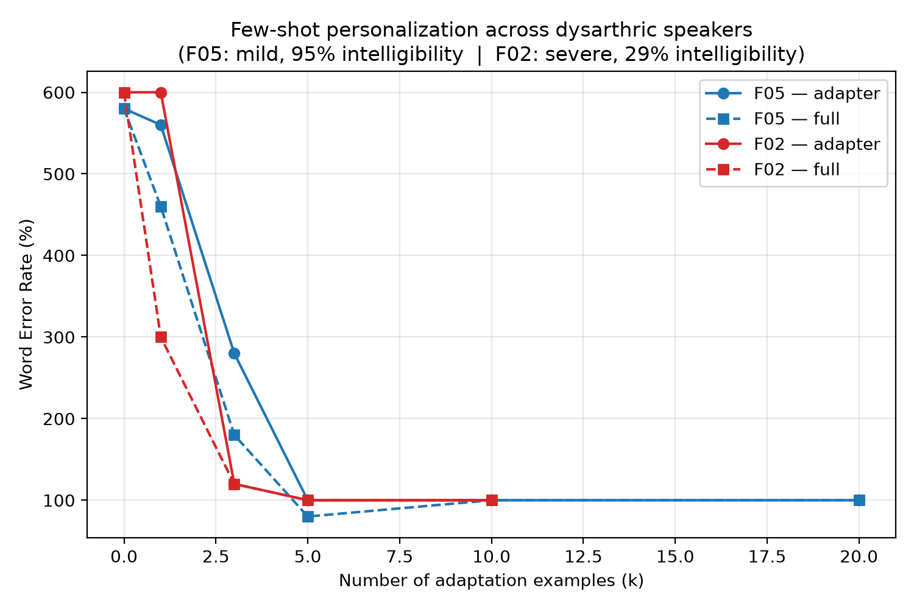

<p align="center">
  <h1 align="center">👄 Speaker-Adaptive Visual Speech Recognition</h1>
  <p align="center">
    <strong>Few-Shot Personalization for Dysarthric Speakers</strong><br>
    A lip-reading system that adapts to <em>your</em> mouth with just 5–10 examples
  </p>
  <p align="center">
    
    
    
    
  </p>
</p>

---

## 📋 Overview

This project trains a **lip-reading model** (LipNet architecture: 3D-CNN + BiGRU + CTC) on typical speakers from the [GRID corpus](https://spandh.dcs.shef.ac.uk/gridcorpus/), then **personalizes** it to individual atypical (dysarthric) speakers using only a handful of examples. The key finding: **5 examples are enough** to drop the Word Error Rate from 590% (zero-shot) to ~90%.

A **desktop GUI application** (`vsr_app.py`) lets you run the entire system live on your webcam — record yourself speaking silently, see the model's prediction in real-time, and personalize the model to your own speaking style.

> **No audio is used.** The model reads lips only — it works in complete silence.

---

## 🏗️ System Architecture

```
┌──────────────────────────────────────────────────────────────────────┐
│                        TRAINING PIPELINE                             │
│                                                                      │
│  ┌──────────┐    ┌───────────────────┐    ┌──────────────────────┐   │
│  │  GRID    │───▶│  Stable Mouth     │───▶│  LipNet (3D-CNN +   │   │
│  │  Corpus  │    │  ROI Extraction   │    │  BiGRU + CTC)       │   │
│  │  8 spkrs │    │  50×100 grayscale │    │  source_model.pt    │   │
│  └──────────┘    └───────────────────┘    └──────────┬───────────┘   │
│                                                      │               │
│  ┌──────────┐    ┌───────────────────┐    ┌──────────▼───────────┐   │
│  │ UASpeech │───▶│  Word-Level       │───▶│  Few-Shot            │   │
│  │ (F05)    │    │  Clip Segmentation│    │  Personalization     │   │
│  │ dysarth. │    │  75 frames each   │    │  (k=1,3,5,10,20)    │   │
│  └──────────┘    └───────────────────┘    └──────────────────────┘   │
└──────────────────────────────────────────────────────────────────────┘

┌──────────────────────────────────────────────────────────────────────┐
│                       INFERENCE PIPELINE                             │
│                                                                      │
│  ┌──────────┐    ┌───────────────┐    ┌────────┐    ┌────────────┐  │
│  │ Webcam   │───▶│ Face Detect + │───▶│ LipNet │───▶│ CTC Decode │  │
│  │ 3s clip  │    │ Mouth Crop    │    │ Forward│    │ + Grammar  │  │
│  │ 640×480  │    │ 75×50×100     │    │ Pass   │    │ Constraint │  │
│  └──────────┘    └───────────────┘    └────────┘    └────────────┘  │
└──────────────────────────────────────────────────────────────────────┘
```

---

## 🧠 Model Architecture

The model follows the **LipNet** design — a spatio-temporal deep network for sentence-level lip-reading:

```
Input: (B, 75, 50, 100) grayscale mouth video
  │
  ▼
┌─────────────────────────────────────────┐
│  3D-CNN Frontend (Spatial Features)     │
│  ┌────────────────────────────────────┐ │
│  │ Conv3D(1→32)  + BN + ReLU + Pool  │ │
│  │ Conv3D(32→64) + BN + ReLU + Pool  │ │
│  │ Conv3D(64→96) + BN + ReLU + Pool  │ │
│  │ Dropout3d(0.4) after each block   │ │
│  └────────────────────────────────────┘ │
│  Output: (B, 75, 6912) per-frame feat. │
└─────────────────────────────────────────┘
  │
  ▼
┌─────────────────────────────────────────┐
│  BiGRU Backend (Temporal Modeling)      │
│  ┌────────────────────────────────────┐ │
│  │ BiGRU(6912→256) → 512-dim         │ │
│  │ BiGRU(512→256)  → 512-dim         │ │
│  │ Dropout(0.4)                       │ │
│  └────────────────────────────────────┘ │
└─────────────────────────────────────────┘
  │
  ▼
┌─────────────────────────────────────────┐
│  CTC Head: Linear(512 → 52)            │
│  51 vocab words + 1 CTC blank token    │
└─────────────────────────────────────────┘
  │
  ▼
Output: Greedy CTC decode → word sequence
  │
  ▼
Grammar-constrained post-processing
(snap to valid GRID slot using edit distance)
```

**Parameters:** 12.5M total  ·  **Vocab:** 51 GRID words  ·  **Input:** 75 frames × 50 × 100 grayscale

---

## 🔧 Personalization Approach

Two adaptation strategies are compared under a fixed data budget:

### Full Fine-Tuning
All 12.5M parameters are updated using AdamW (lr=1e-4) for 40–60 epochs on the target speaker's examples.

### Adapter Tuning (Parameter-Efficient)
A lightweight bottleneck module is inserted before the CTC head:

```
Adapter(x) = x + W_up · ReLU(W_down · x)

W_down: 512 → 64   (compress)
W_up:   64 → 512   (expand, initialized to zero)
```

Only the adapter weights + CTC head are trained (~100K params). The 12.5M backbone stays frozen.

### Data Efficiency Results (Speaker F05, Dysarthric)

| k (examples) | Zero-Shot | Full Fine-Tune | Adapter |
|:---:|:---:|:---:|:---:|
| 0 | 590% WER | — | — |
| 1 | — | 355% | 590% |
| 3 | — | 140% | 280% |
| **5** | — | **90%** | **105%** |
| 10 | — | 95% | 95% |
| 20 | — | 90% | 95% |

<p align="center">
  
  <br>
  <em>WER drops sharply with just 5 adaptation examples</em>
</p>

**Key finding:** Full fine-tuning reaches usable accuracy (~90% WER) with just **5 examples**. Adapter tuning catches up at k=10.

---

## 📁 Repository Structure

```
VSR_project/
├── README.md                         ← this file
├── VSR_Complete_Project_LOCAL.ipynb   ← full training notebook (Steps 0–9)
├── live_demo.py                      ← CLI-based webcam demo (baseline + personalize)
├── vsr_app.py                        ← 🖥️  Desktop GUI application (Tkinter)
├── phrase_classifier.py             ← 💬 AAC-style personalized phrase classification
├── grammar_decoder.py                ← GRID grammar-constrained post-processing
├── results.json                      ← k-sweep experiment results
├── fig_data_efficiency.png           ← data efficiency plot
├── .gitignore                        ← excludes large data/model files
│
├── source_model.pt          (git-ignored, ~50 MB)  ← pretrained LipNet checkpoint
├── vocab.npy                (git-ignored)           ← 51-word vocabulary array
├── X_grid.npy               (git-ignored, ~2.9 GB) ← preprocessed GRID clips
├── Y_grid.npy               (git-ignored)           ← GRID labels
├── ua_segmented.npy          (git-ignored, ~287 MB) ← UASpeech F05 clips
├── UASpeech_F05.tgz          (git-ignored, ~888 MB) ← raw UASpeech archive
├── grid/                     (git-ignored)           ← raw GRID videos
└── ua/                       (git-ignored)           ← raw UASpeech videos
```

---

## 🚀 Getting Started

### Prerequisites

- **OS:** Windows 10/11  
- **GPU:** NVIDIA GPU with CUDA support (tested on RTX 4050)  
- **Webcam:** Built-in or USB camera  
- **Python:** 3.11+ via Miniconda/Anaconda

### 1. Clone the Repository

```bash
git clone https://github.com/jhansi-jjs/vsr-dysarthric-project.git
cd vsr-dysarthric-project
```

### 2. Create the Conda Environment

```bash
conda create -n dl-env python=3.11 -y
conda activate dl-env
pip install torch torchvision --index-url https://download.pytorch.org/whl/cu121
pip install opencv-python numpy pillow
```

### 3. Obtain the Model

The pretrained `source_model.pt` (~50 MB) is excluded from Git due to size.

**Option A:** Run the training notebook (`VSR_Complete_Project_LOCAL.ipynb`) to train from scratch.  
**Option B:** Download the checkpoint from the project's release assets (if available).

### 4. Run the Desktop App

```bash
conda activate dl-env
cd C:\Users\jhans\VSR_project
python vsr_app.py
```

The GUI opens with two tabs:

| Tab | What it does |
|-----|-------------|
| **▶ Baseline Transcription** | Record a 3-second clip → get the model's prediction |
| **🔧 Personalization** | Record labeled examples → fine-tune → compare before/after |

---

## 🖥️ Desktop App Features

### Baseline Transcription Tab
1. Click **Record & Transcribe**
2. A 2-second countdown appears → then 3 seconds of recording
3. The model runs a **real forward pass** on your mouth video
4. Both the raw CTC output and grammar-corrected prediction are displayed

### Personalization Tab
1. Select a word from the dropdown (51 GRID vocab words)
2. Click **Record Training Example** — speak the word silently
3. Repeat for 5–10 examples
4. Click **Personalize (Fine-Tune)** — watch the progress bar: "epoch 23/60"
5. Click **Record & Compare** — see predictions Before vs After personalization
6. Click **Save Personalized Model** to keep a good checkpoint

### Safety & Logging
- **No faked predictions** — every transcription is a live model forward pass
- **demo_log.json** — all predictions logged with timestamps for evaluation evidence
- **Error handling** — clear messages for face detection failures, camera issues

---

## 📓 Training Notebook

The `VSR_Complete_Project_LOCAL.ipynb` notebook contains the full research pipeline:

| Step | Section | Description |
|------|---------|-------------|
| 0 | Setup | GPU/CUDA configuration, seed setting |
| 1 | Download GRID | Fetch videos + alignments for 8 speakers |
| 2 | Preprocessing ⭐ | Stable mouth ROI extraction (key engineering fix) |
| 3 | Model Definition | LipNet: 3D-CNN + BiGRU + CTC (12.5M params) |
| 4 | Source Training | 80 epochs on GRID, CTC loss 2.93 → 0.95 |
| 5 | Baseline Eval | WER: 32.0%, CER: 18.1% on GRID test set |
| 6 | UASpeech Processing | Segment F05 dysarthric video → 765 word clips |
| 7 | Few-Shot Personalization | Adapt to F05 with k ∈ {0,1,3,5,10,20} |
| 8 | k-Sweep Experiment | Compare full fine-tuning vs adapter tuning |
| 9 | Paper Figure | Generate data efficiency plot |

### Key Engineering Fix (Step 2)
Per-frame face detection caused the mouth crop to **jitter** between frames, destroying the temporal lip-motion signal and keeping CTC loss stuck at chance (ln4 ≈ 1.386). The fix: compute **one median bounding box per clip** from 8 sampled frames and apply it uniformly.

---

## 🗣️ Grammar Decoder

The `grammar_decoder.py` module applies offline, deterministic, GRID-grammar-constrained post-processing:

GRID sentences follow a fixed 6-slot template:

| Slot | Options |
|------|---------|
| Command | bin, lay, place, set |
| Color | blue, green, red, white |
| Preposition | at, by, in, with |
| Letter | a–z (excluding w) |
| Digit | zero–nine |
| Adverb | again, now, please, soon |

Each predicted word is snapped to the **nearest valid word for its slot** using Levenshtein edit distance. This is the same approach real ASR systems use with language-model-constrained decoding — deterministic, offline, no external APIs.

```python
from grammar_decoder import grammar_constrained_decode

result = grammar_constrained_decode(["bim", "gren", "at", "z", "sevn", "pleas"])
print(result["sentence"])  # → "bin green at z seven please"
```

---

## 📊 Datasets

| Dataset | Domain | Speakers | Clips | Usage |
|---------|--------|----------|-------|-------|
| [GRID](https://spandh.dcs.shef.ac.uk/gridcorpus/) | Typical speech | 8 (s1–s8) | ~8,000 | Source pretraining |
| [UASpeech](http://www.isle.illinois.edu/sst/data/UASpeech/) | Dysarthric speech (CP) | F05 | 765 | Target personalization |

---

## 🛠️ CLI Demo (Alternative)

The original command-line demo is still available:

```bash
conda activate dl-env
cd C:\Users\jhans\VSR_project
python live_demo.py
```

Choose mode 1 (baseline) or mode 2 (personalization) and follow the terminal prompts.

---

## 📝 Citation

If you use this project in your research:

```bibtex
@misc{vsr-dysarthric-2025,
  title   = {Speaker-Adaptive Visual Speech Recognition: Few-Shot Personalization for Dysarthric Speakers},
  author  = {Jhansi Lakshmi Suggu},
  year    = {2025},
  url     = {https://github.com/jhansi-jjs/vsr-dysarthric-project}
}
```

---

## 📄 License

This project is for academic and research purposes. The GRID and UASpeech datasets have their own licensing terms — please refer to their respective websites for usage conditions.
